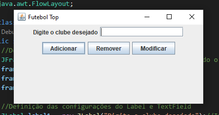

# INTERFACE GRÁFICA

Este programa se compõe se uma criação de uma tela utilizando a bibliote javax e swing do java para tal feito
## 🚀 Começando

ETAPA 1

CRIE UM PROJETO EM JAVA E REPRODUZA O EXEMPLO DO SLIDE ANTERIOR;

CONFIRA SE O MESMO ESTÁ FUNCIONANDO;

COMENTE O CÓDIGO ESCRITO DEMONSTRANDO SEUS CONHECIMENTOS SOBRE O ITEM;

CRIE UM REPOSITÓRIO REMOTO E NOMEIE COM MODELO_TELA;
### 📋 Pré-requisitos

De que coisas você precisa para instalar o software e como instalá-lo?

```
.
```

### 🔧 Instalação

* Definição e configuração de cada container e componentes para a criação e composição de tela

## 🛠️ Construído com

Ferramentas utilizadas e bibliotecas

* VS CODE

## 📌 Versão

* **Versão 1.0** 

## ✒️ Autores

* **João Henrique Santos da Silva** - *Trabalho Inicial* - Inferface Gráfica - Modelo tela

## Modelo de tela
* **Modelo de tela**

